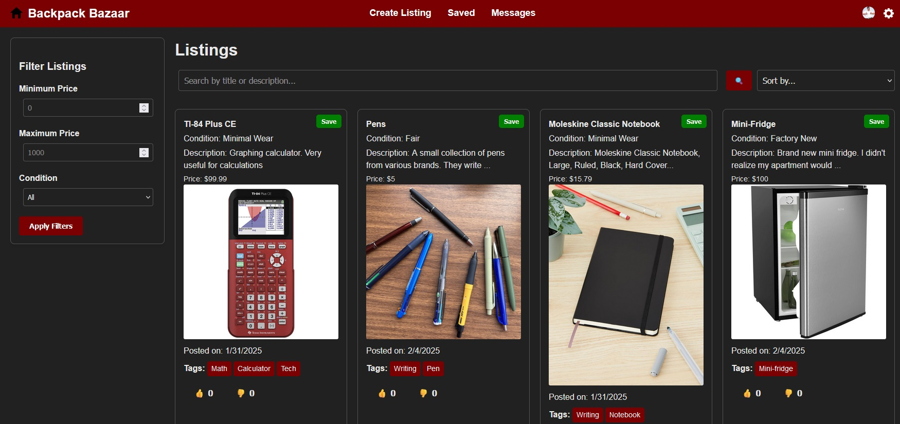
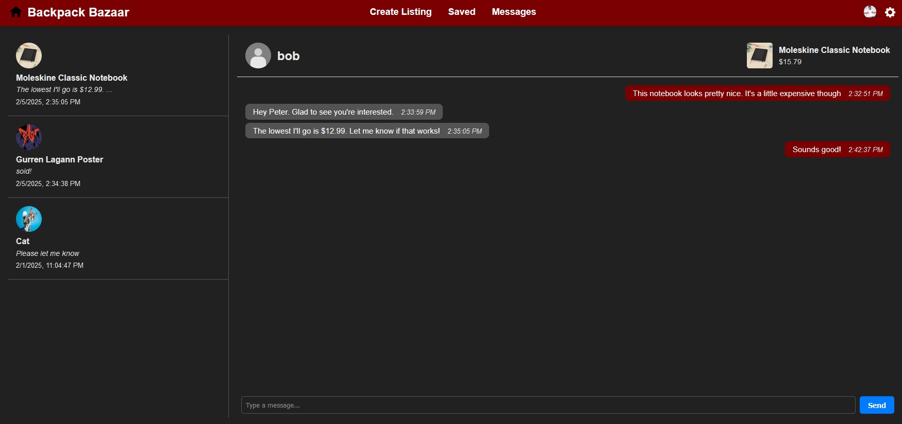

<!-- ABOUT THE PROJECT -->
## About The Project
This project, Backpack Bazaar, is an extension of a group project I worked on previously -> https://github.com/bennettbDEV/CollegeMarketplace. The goal of this project is to: 
- Refactor the backend to use Django's ORM, which will be faster and more reliable
- Add more customization options
- Implement automatic listing classification using AI/ML
- Develop an algorithm/method to provide suggested/recommended listings to users

<br>

<div align="center">
  <a href="https://github.com/bennettbDEV/BackpackBazaar">
    
  </a>
</div>
With the abundance of irrelevant and distant listings on classified advertising platforms such as Facebook Marketplace and Craigslist,
our team decided to develop an open-source marketplace platform tailored to students. To achieve this goal and learn as much as possible about
critical tools in the software industry, we chose to develop the platform using Django Rest Framework (Python) for the backend API, and React + Vite (JavaScript/JSX) for the frontend. 

## Features
Our project includes all the vital features of an online marketplace, and more! Some of our notable features & details are below:
- Secure authentication using JSON Web Tokens (JWT)
- Comprehensive account management: creation, retrieval, updates, and deletion
- Listing management with filtering, searching, sorting, and saving for later access
- Messaging capabilities: sending, retrieving, and deleting messages
- User interaction features: liking/disliking listings and blocking/unblocking other users

### Expanded Features
Backpack Bazaar is not only more efficient, but is also more feature rich than the original College Marketplace!
Some notable new features include:

- Automatic tag generation when creating or updating listings (using a One-vs-rest [SVC](https://scikit-learn.org/stable/modules/generated/sklearn.svm.SVC.html))
- Reworked messages on the backend, allowing for specific conversations for each listing
- Frontend Changes
    - Implemented Dark mode
    - Improved accessibility features & styling
    - Fixed various bugs
    - Completely rehauled the messaging page
<h4>Details</h4>

- Each endpoint was designed with robust error handling, with specific and detailed responses for various different issues
- Critical use cases were thoroughly tested with comprehensive unit tests and integration tests to ensure both reliability and security

<br/>
<br/>

**Image Showcase**

Here are some additional screenshots showing different pages from our frontend:
<div>
  <a>
    
  </a>
</div>

## Roadmap

- [X] Add dark mode
- [X] Refactor front-end to use rems instead of px
- [X] Refactor authentication using Django's built in tools
- [X] Alter User/UserProfile to use Django's ORM
- [ ] Test User/UserProfile
- [X] Alter Listing to use Django's ORM
- [X] Test Listing
- [X] Alter Messages to use Django's ORM
- [X] Test Messages
- [X] New message frontend
- [ ] Add tests for every feature
- [X] Frontend Integration
- [ ] Test Frontend more thoroughly
- [X] Add automatic listing classification
- [ ] Develop algorithm to suggest listings

## Try it out!
To install the dependencies and run the project as it is now, follow these simple steps in your terminal:

0. Prerequisites:
Install [Node.js](https://nodejs.org/en/download/package-manager)(version 20 or newer) and [Python](https://www.python.org/downloads/)(version 3.10 or newer)
1. Clone the repo (into the currect directory)
```sh
git clone https://github.com/bennettbDEV/BackpackBazaar.git .
```
2. (Optionally) Set up a [virtual environment](https://www.freecodecamp.org/news/how-to-setup-virtual-environments-in-python/)
```sh
python -m venv venv
```
2a. Activate the virtual environment - for Windows:
```sh
.\venv\Scripts\activate
```
2b. Activate the virtual environment - for Linux/Mac:
```sh
source venv/bin/activate
```
3. Move to the backend directory 
```sh
cd backend
```
4. Install necessary packages
```sh
python -m pip install -r requirements.txt
```
5. Navigate back to the base directory
```sh
cd ..
```
6. Go to the frontend directory
```sh
cd frontend
```
7. Install necessary packages
```sh
npm install
```
8. Create an env file (Links our development servers together)
```sh
echo VITE_API_URL="http://localhost:8000/" > .env
```
**Run the servers** <br/>
9. Start the frontend
```sh
npm run dev
```
10. After splitting or creating a new terminal, navigate to BackpackBazaar/backend
```sh
cd ..
cd backend
```
11. Start the backend
```sh
python manage.py runserver
```
12. Done!
    Open a browser and enter "http://localhost:5173/" into the search bar to interact with the Marketplace
